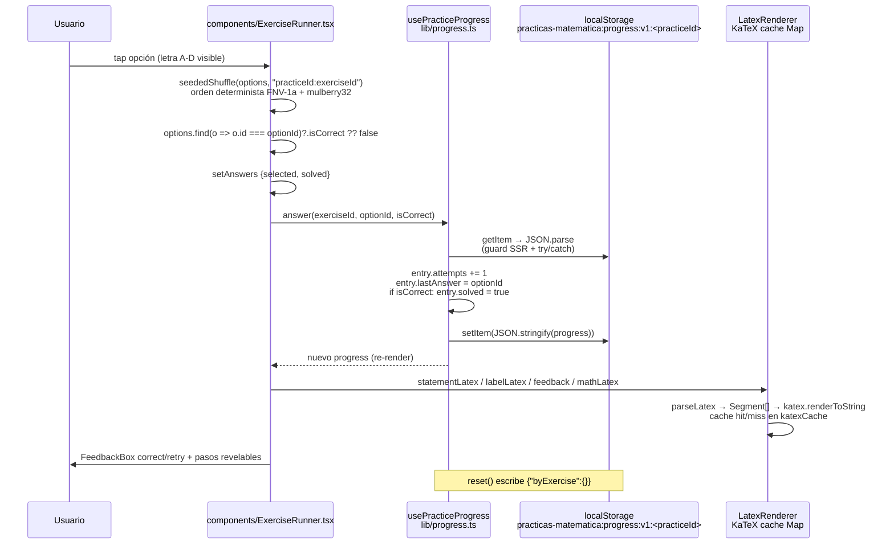
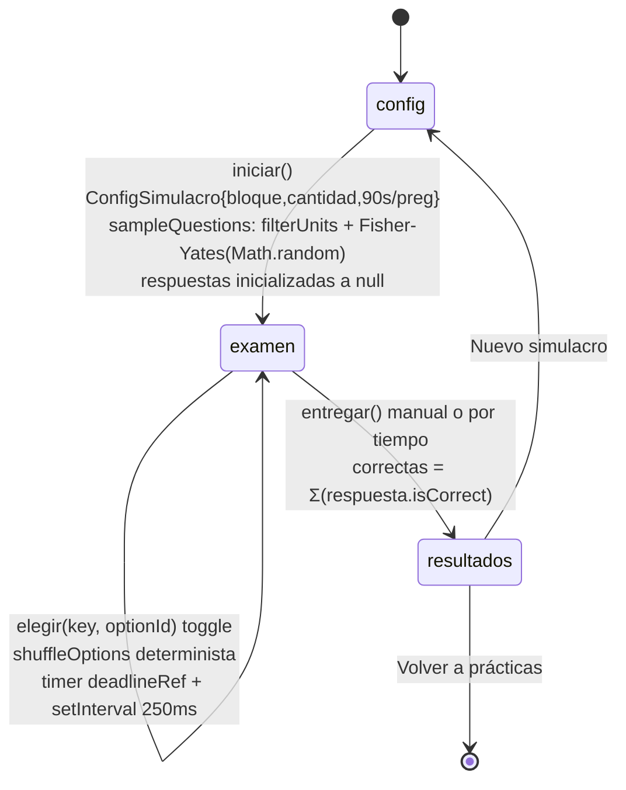

# Data Flow Analysis

Aplicación: sitio Next.js 16 App Router **100 % estático** (`output: 'export'`, `trailingSlash: true` en `next.config.mjs`). No hay backend, ni API routes, ni base de datos. Todo el dato de dominio vive como constantes TypeScript en `data/`; el único estado persistente del usuario se guarda en `localStorage`. Los flujos son: (1) dataset → SSG build → HTML estático; (2) interacción del usuario → estado React → `localStorage`; (3) `localStorage` + dataset → vistas derivadas (`/repaso`, tarjetas de inicio).

## Data Models Overview

### Modelos de dominio (fuente única de verdad: `data/practices.ts`)

| Modelo | Campos | Definición |
|---|---|---|
| `PracticeUnit` | `id`, `title`, `subject`, `description`, `theory: TheorySection[]`, `exercises: Exercise[]`, `topic?`, `method?` | `data/practices.ts:47` |
| `TheorySection` | `title`, `contentLatex`, `diagramSvg?: string`, `examples: {title, statementLatex, solutionLatex}[]` | `data/practices.ts:35` |
| `Exercise` | `id`, `title`, `statementLatex`, `diagramSvg?: string`, `options: ExerciseOption[]`, `steps: Step[]` | `data/practices.ts:25` |
| `ExerciseOption` | `id`, `labelLatex`, `isCorrect: boolean`, `feedback?: string` | `data/practices.ts:18` |
| `Step` | `stepNumber`, `explanation`, `mathLatex?: string` | `data/practices.ts:12` |

Todos los campos textuales (`statementLatex`, `labelLatex`, `contentLatex`, `solutionLatex`, `feedback`, `mathLatex`) son strings con LaTeX embebido usando delimitadores `$...$` / `$$...$$`.

### Agregación del dataset

- `data/practices.ts` define 3 unidades inline: `factorizacion`, `simplificacionRacionales`, `operacionesRacionales`.
- Importa y spread-ea los archivos de datos:
  - `data/practica02.ts` → `practica02Units` (5 unidades: `p2-factor-comun`, `p2-agrupacion`, `p2-inspeccion`, `p2-binomios`, `p2-combinados`).
  - `data/trigonometria.ts` → `trigonometriaUnits` (`elevacion-depresion`, ley de senos).
  - `data/racionales-suma-resta.ts` → `sumaRestaUnits`.
  - `data/completar-cuadrados.ts` → `completarCuadradosUnits`.
- Exporta el arreglo agregado `practices: PracticeUnit[]` (`data/practices.ts:1560`, 12 unidades) y dos accesores: `getPractice(id)` (`find` por id, devuelve `undefined` si no existe) y `getPracticeIds()`.

### Modelos derivados (transformaciones en runtime)

| Modelo | Campos | Origen |
|---|---|---|
| `ExerciseProgress` | `attempts: number`, `solved: boolean`, `lastAnswer: string \| null` | `lib/progress.ts:7` |
| `PracticeProgress` | `byExercise: Record<string, ExerciseProgress>` | `lib/progress.ts:16` |
| `ItemRepaso` | `key: "\${practiceId}:\${exerciseId}"`, `practiceId`, `practiceTitle`, `exercise: Exercise` | `lib/repaso.ts:9` |
| `ConteoErrores` | `pendientes`, `reintentados` | `lib/repaso.ts:16` |
| `BloqueSimulacro` | `'todos' \| 'trigonometria' \| 'algebra'` | `lib/simulacro.ts:7` |
| `ConfigSimulacro` | `bloque`, `cantidad`, `segundosPorPregunta` | `lib/simulacro.ts:9` |
| `PreguntaSimulacro` | `key`, `practiceId`, `practiceTitle`, `exercise: Exercise` | `lib/simulacro.ts:15` |
| `ResultadoSimulacro` | `fecha` (ISO string), `bloque`, `correctas`, `total`, `segundosUsados` | `lib/simulacro.ts:23` |

### Artefacto embebido en el modelo

`Exercise.diagramSvg` / `TheorySection.diagramSvg` contienen strings `<svg>` autocontenidos producidos por los generadores paramétricos exportados de `lib/diagrams.ts` (`diagElevacion`, `diagDepresion`, `diagHipotenusa`, `diagCombinada`, `diagDosObservaciones`, `diagAntena`, `diagSombras`, `diagAuto`, `diagDron`, `diagTriangulo`, `diagTrianguloRectangulo`). Se invocan en tiempo de evaluación del módulo `data/trigonometria.ts` (p. ej. `diagramSvg: diagElevacion({...})`), es decir, el SVG queda congelado como constante del bundle en build time.

## Data Transformation Map

### Fase A — Build time (SSG)

```
PDFs oficiales (public/pdfs/*.pdf, fuente humana)
        │  transcripción manual
        ▼
data/*.ts (constantes PracticeUnit[], LaTeX + diagramas SVG ya resueltos)
        │  import estático
        ▼
practices: PracticeUnit[]  ── getPracticeIds() ──▶ generateStaticParams()
        │                                              en app/practica/[id]/teoria/page.tsx
        │                                              y app/practica/[id]/ejercicios/page.tsx
        ▼
getPractice(params.id) ──▶ props serializables al componente cliente
        │                    (ExerciseRunner / TheoryView)
        ▼
HTML estático en out/ (con trailingSlash)
```

- `app/page.tsx` importa `practices` directamente y calcula totales (`practices.reduce(...)` sobre `exercises.length`) para el encabezado; pasa el mismo arreglo a `ContinueCard`, `RepasoCard`, `PracticeCatalog` vía props.
- No hay fetch ni capa DTO: las props SON el modelo de dominio (serializado por React Server Components al hidratar).

### Fase B — Transformaciones de presentación (cliente)

1. **LaTeX → HTML**: `components/LatexRenderer.tsx`
   - `parseLatex(content)` (línea 16): tokenizer manual que divide un string mixto en `Segment[]` de tipo `'text' | 'inline' | 'block'` según `$...$` / `$$...$$` (regex, el bloque gana si aparece primero o en la misma posición).
   - `renderLatex(latex, displayMode)` (línea 58): `katex.renderToString(...)` con `throwOnError: false, strict: 'ignore'`; resultado cacheado en el Map global `katexCache: Map<string,string>` con clave `"D::latex" | "I::latex"` (línea 56). Inyección con `dangerouslySetInnerHTML`.
   - Es el único canal de salida para todo contenido matemático (enunciados, opciones, feedback, pasos, teoría, títulos).

2. **Mezcla determinista de opciones** (dos implementaciones idénticas del mismo algoritmo FNV-1a + mulberry32):
   - `seededShuffle(items, seedKey)` en `components/ExerciseRunner.tsx:24`.
   - `shuffleOptions(items, seedKey)` en `lib/simulacro.ts:68`.
   - Semilla: `` `${practiceId}:${exercise.id}` `` → orden estable entre sesiones y entre SSR/cliente (evita mismatch de hidratación); las letras A/B/C/D se asignan por posición mostrada pero la selección sigue usando el `option.id` original.
   - Consumidores: `ExerciseRunner`, página `/simulacro`, página `/repaso`.

3. **Diagramas SVG**: `components/DiagramSvg.tsx` recibe el string pregenerado y lo inyecta con `dangerouslySetInnerHTML` dentro de un `figure.overflow-x-auto`. Sin transformación adicional.

4. **Derivación de vistas de progreso** (joins dataset × localStorage):
   - `countSolved(progress)` (`lib/progress.ts:63`): cuenta entradas `solved`.
   - `contarErrores(practices)` (`lib/repaso.ts:23`) y `collectRepaso(practices, incluirReintentados)` (`lib/repaso.ts:42`): por cada unidad cargan su `PracticeProgress` y clasifican cada ejercicio — *pendiente* = `attempts > 0 && !solved`; *reintentado* = `solved && attempts > 1`. Producen `ItemRepaso[]` con clave `${practiceId}:${exerciseId}`.
   - `ContinueCard.tsx` (líneas 16–28): escanea todas las prácticas con `loadPracticeProgress` + `countSolved` y elige la de mayor avance incompleto (regla: `0 < count < total`, máximo `bestSolved`).
   - `filterUnits(practices, bloque)` (`lib/simulacro.ts:34`): filtra por `subject === 'Trigonometría' | 'Álgebra'`.
   - `sampleQuestions(practices, config)` (`lib/simulacro.ts:44`): aplana el banco filtrado a `PreguntaSimulacro[]` (dedup por key) y muestrea sin repetición con Fisher-Yates + `Math.random` (solo cliente).

## Storage Interactions

Único mecanismo de persistencia: `window.localStorage`. Sin cookies, sin `sessionStorage`, sin IndexedDB, sin red (verificado: solo 4 referencias reales a `localStorage` en `lib/`).

| Clave | Valor JSON | Escritor | Lector | Borrado |
|---|---|---|---|---|
| `practicas-matematica:progress:v1:<practiceId>` | `PracticeProgress` | `savePracticeProgress` (`lib/progress.ts:34`), `recordAnswer` (línea 43, read-modify-write) | `loadPracticeProgress` (línea 22), usado por `usePracticeProgress`, `PracticeCard`, `ContinueCard`, `RepasoCard` (vía `contarErrores`/`collectRepaso`) | lógico: `reset()` escribe `{ byExercise: {} }` |
| `practicas-matematica:simulacro:last:v1` | `ResultadoSimulacro` | `saveLastResult` (`lib/simulacro.ts:94`), invocado desde `app/simulacro/page.tsx` al entrar en fase `'resultados'` | `loadLastResult` (línea 103), usado por `app/simulacro/page.tsx` y `components/SimulacroCard.tsx` | sobrescrito en cada simulacro; nunca se elimina |

Patrón defensivo común a ambos módulos:

```ts
if (typeof window === 'undefined') return <valor vacío>;   // guard SSR
try { JSON.parse(...) } catch { return <valor vacío>; }    // JSON corrupto
// setItem también envuelto en try/catch (modo privado, cuota llena)
```

Nota: el prefijo real de clave es `practicas-matematica:progress:v1:` (constante `STORAGE_KEY` en `lib/progress.ts:20`); el sufijo `<practiceId>` va tras `:`.

### Activos estáticos (sin transformación)

- `public/pdfs/practica02.pdf`, `public/pdfs/practica03.pdf`: descargados con `<a download>` desde `components/PdfDownloads.tsx` (metadatos hardcodeados en el arreglo local `downloads: PdfDownload[]`: filename/title/description/size).
- `public/fonts/KaTeX_*.woff2`: precargados vía `<link rel="preload">` en `app/layout.tsx` para el CSS global `katex/dist/katex.min.css`.
- `public/latex/practica02.tex`: fuente LaTeX de referencia, no consumida por la app.

## Validation Mechanisms

No existe validación de esquema en runtime (ni Zod, ni validadores manuales completos). La "validación" se reparte así:

1. **Tipado estático**: TypeScript estricto garantiza la forma de `PracticeUnit` y derivados en compile time; los datasets son literales tipados (`const x: PracticeUnit = {...}`), así que cualquier campo faltante falla el build (`tsc --noEmit` vía `make check`).
2. **Guardas estructurales al deserializar**: `loadPracticeProgress` comprueba `parsed && parsed.byExercise` antes de aceptar el objeto; cualquier desviación → `{ byExercise: {} }`. `loadLastResult` solo hace cast sin verificar campos.
3. **Validación de respuesta**: la corrección no se calcula, se consulta — `options.find((o) => o.id === optionId)?.isCorrect ?? false`:
   - `components/ExerciseRunner.tsx` (`selectOption`, línea 132).
   - `app/repaso/page.tsx` (`elegir`, línea 65).
   - `app/simulacro/page.tsx` (corrección diferida en fase `'resultados'`, líneas 144–149 y 166–178).
4. **Resolución de rutas dinámicas**: `getPractice(id)` → `undefined` → `notFound()` en ambas páginas `[id]`.
5. **Reglas de flujo UI como invariantes**: opción bloqueada tras `solved` (`fieldset disabled`); `canProceed = state.selected !== null || steps === exercise.steps.length`; en repaso, responder correctamente elimina el item de futuras colas; en simulacro, entrega automática cuando el temporizador llega a 0 (`tick()` → `entregar(true)`).

## State Management Analysis

Sin librerías de estado global ni React Context. Tres niveles:

1. **Estado persistente (localStorage)** encapsulado en el hook `usePracticeProgress(practiceId)` (`lib/progress.ts:71`):
   - `progress`: `useState` con inicializador síncrono que lee localStorage.
   - `answer(exerciseId, optionId, isCorrect)`: delega en `recordAnswer` (lee disco → muta entrada → escribe disco → devuelve nuevo objeto) y actualiza el estado.
   - `reset()`: escribe vacío en disco y resetea estado.
   - Consumidor principal: `components/ExerciseRunner.tsx` (además mantiene `current`, `answers: Record<string, AnswerState>` inicializado desde el progreso guardado, `stepsShown: Record<string, number>`, `confirmReset`, `showTheory`).

2. **Estado efímero de sesión por vista**:
   - `app/simulacro/page.tsx`: máquina de estados `fase: 'config' | 'examen' | 'resultados'`; `preguntas: PreguntaSimulacro[]`, `respuestas: Record<key, optionId|null>`, `actual`, `segundosRestantes/segundosUsados`, `stepsShown`; temporizador imperativo con `deadlineRef` (timestamp) + `setInterval(250ms)` que recalcula contra `Date.now()` y autocompacta al agotarse. El examen NO persiste respuestas parciales: si se abandona la página, se pierden (solo el resultado final se guarda).
   - `app/repaso/page.tsx`: carga inicial en `useEffect` (patrón cliente-only para evitar mismatch): `items = collectRepaso(practices, false)`, `conteo = contarErrores(practices)`; `estados: Record<key, EstadoItem{seleccion, correcto}>`, `pasos`, `intentosSesion`. Cada respuesta llama a `recordAnswer` directo (sin hook) para sincronizar el disco global; el toggle "incluir reintentados" reconstruye la cola preservando los estados de sesión existentes por `key` (Map merge, líneas 55–63).
   - Tarjetas de inicio (`PracticeCard`, `ContinueCard`, `RepasoCard`, `SimulacroCard`): leen localStorage solo en `useEffect` (post-hidratación) y guardan el derivado en `useState` local.
   - `PracticeCatalog`: filtros efímeros `query` (búsqueda textual case-insensitive sobre title/description) y `subject` (chips derivados de `Array.from(new Set(practices.map(p => p.subject))).sort()`).
   - `TheoryView`: `openExamples: Record<"i-j", boolean>` para acordeones.

3. **Estado inmutable de build**: todo `data/` se evalúa una vez por build; los componentes server (`app/page.tsx`, páginas `[id]`) lo tratan como datos de solo lectura y lo pasan como props.

## Serialization Processes

| Proceso | Formato | Detalle |
|---|---|---|
| Dataset → props RSC → HTML | implícito (React Flight/HTML) | Next serializa `PracticeUnit` (JSON-safe puro: strings, números, booleanos, arreglos, objetos planos) al incrustarlo en el HTML estático para hidratación. Sin funciones ni símbolos en el modelo → serializable sin configuración. |
| `PracticeProgress` ⇄ localStorage | `JSON.stringify` / `JSON.parse` con cast `as PracticeProgress` | `lib/progress.ts:37` y `:27`. Parse tolerante a fallos. |
| `ResultadoSimulacro` ⇄ localStorage | `JSON.stringify` / `JSON.parse` con cast | `lib/simulacro.ts:97` y `:107`. `fecha` serializada con `new Date().toISOString()`. |
| LaTeX → HTML | KaTeX `renderToString` | `throwOnError: false` → entrada malformada nunca lanza, produce HTML con clase de error. Cacheado por (modo, latex). |
| SVG → DOM | string crudo vía `dangerouslySetInnerHTML` | Confiable por construcción propia (`lib/diagrams.ts`), sin escape necesario según el diseño. |

Puntos de riesgo conocidos del diseño (descriptos, no hipotéticos): `lastAnswer` guarda el `option.id`, que es estable; el orden mostrado depende de la semilla determinista, por lo que el id almacenado siempre corresponde a la misma etiqueta aunque cambie la posición visual. El cast de `ResultadoSimulacro` no valida campos individuales.

## Data Lifecycle Diagrams

### Ciclo 1 — Dataset a HTML estático (build time)

```mermaid
flowchart LR
    PDF[public/pdfs/*.pdf<br/>documento oficial] -->|transcripción| DS[data/practica02.ts<br/>data/racionales-suma-resta.ts<br/>data/completar-cuadrados.ts]
    DIAG[lib/diagrams.ts<br/>generadores SVG paramétricos] -->|invocación a nivel de módulo<br/>diagramSvg: diagX&#40;&#41;| TRI[data/trigonometria.ts]
    CORE[data/practices.ts<br/>3 unidades inline<br/>+ tipos Step/ExerciseOption/<br/>Exercise/TheorySection/PracticeUnit]
    DS --> CORE
    TRI --> CORE
    CORE --> AGG["practices: PracticeUnit[] (12)<br/>getPractice / getPracticeIds"]
    AGG --> GSP["generateStaticParams()<br/>app/practica/[id]/{teoria,ejercicios}"]
    GSP --> PG["getPractice&#40;params.id&#41;<br/>→ notFound&#40;&#41; si undefined"]
    PG --> RUNNER["ExerciseRunner (client)"]
    PG --> TV["TheoryView (client)"]
    AGG --> HOME["app/page.tsx<br/>totales + props"]
    HOME --> CAT[PracticeCatalog]
    HOME --> CC[ContinueCard]
    HOME --> RC[RepasoCard]
    HOME --> SC[SimulacroCard]
    HOME --> PD[PdfDownloads<br/>enlaces a public/pdfs]
    RUNNER --> OUT[out/ HTML estático]
    TV --> OUT
    CAT --> OUT
```



### Ciclo 2 — Responder un ejercicio en práctica (escritura de progreso)



### Ciclo 3 — Vistas derivadas: repaso y continuar

```mermaid
flowchart TD
    subgraph Disco
        LS1[(localStorage:<br/>progress:v1:* por práctica)]
    end
    subgraph Dataset
        PR[practices: PracticeUnit[]]
    end
    PR --> REP["lib/repaso.ts<br/>contarErrores → ConteoErrores<br/>collectRepaso → ItemRepaso[]<br/>pendiente: attempts>0 && !solved<br/>reintentado: solved && attempts>1"]
    LS1 --> REP
    PR --> CONT[ContinueCard:<br/>elige práctica con mayor<br/>avance incompleto]
    LS1 --> CONT
    REP --> RPAGE[app/repaso/page.tsx<br/>cola navegable]
    RPAGE -->|"elegir() → recordAnswer()"| LS1
    RPAGE --> SHUF[shuffleOptions<br/>lib/simulacro.ts]
    RPAGE --> LR2[LatexRenderer / DiagramSvg / FeedbackBox]
    CONT --> CARD[card 'Continúa donde quedaste']
    REP --> RCARD[RepasoCard contador]
```

### Ciclo 4 — Simulacro cronometrado (estado efímero + resultado persistido)



```mermaid
flowchart LR
    Q["preguntas: PreguntaSimulacro[]"] --> CALC{"fase==='resultados'"<br/>useEffect"}
    R["respuestas: Record<key, optionId|null>"] --> CALC
    CALC --> RES["ResultadoSimulacro {fecha: ISO,<br/>bloque, correctas, total, segundosUsados}"]
    RES -->|"saveLastResult"| LSK[("localStorage<br/>practicas-matematica:simulacro:last:v1")]
    LSK -->|"loadLastResult"| SIMPAGE[app/simulacro/page.tsx<br/>revisión paso a paso]
    LSK -->|"loadLastResult"| SCARD[SimulacroCard<br/>'Último intento']
```

---

*Análisis generado a partir del código real en el repositorio; contratos de tipos cruzados con `docs/SCHEMA.md`.*
